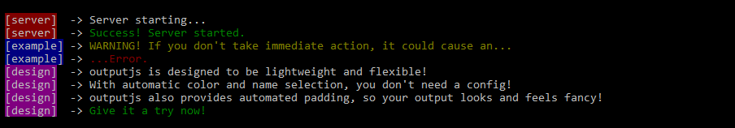

# outputjs

[](https://greenkeeper.io/)
[](https://travis-ci.org/froehlichA/outputjs)


:pencil: A simplistic node.js logger that can be configured to the max.



* No configuration necessary!
* Name & Color support!
* Automatic padding!
* Info, Success, Error, and warn functions!
* A debug function that can be toggled!
* Automatic name & color selection!
## Usage
You can choose to either pass options as an argument...
```javascript
const logger = require('outputjs');
const chalk = require('chalk');
const options = {
    name: 'server',       //Name of the logger. Will be displayed in [] tags. DEFAULT: Name of caller file
    color: chalk.bgGreen, //Color used for highlighting the name. DEFAULT: random unique color
    padding: 10,          //Padding with x width for the name. DEFAULT: 10
    prefix: '-->',        //Prefix used after the name. DEFAULT: "->"
    debug: true,          //Enables output with .debug() DEFAULT: false
    debugPrefix: 'D: ',   //Prefix used for debugging. DEFAULT: "DEBUG:"
    filePath: 'output.js' //Outputs everything to a file. Doesn't support colors. DEFAULT: false
}
const server = new logger(options);
```
...or simple go with no configuration at all.
```javascript
const logger = require('outputjs');
const server = new logger();
```

The following functions are available to you:
```javascript
server.debug("A debug message! Without debug set to true, it won't display. Highlighted in bright yellow.");
server.info("A info message! Highlighted in white.");
server.success("A success message! Highlighted in green.");
server.warn("A warn message! Highlighted in yellow.");
server.error("A error message! Highlighted in red.");
```